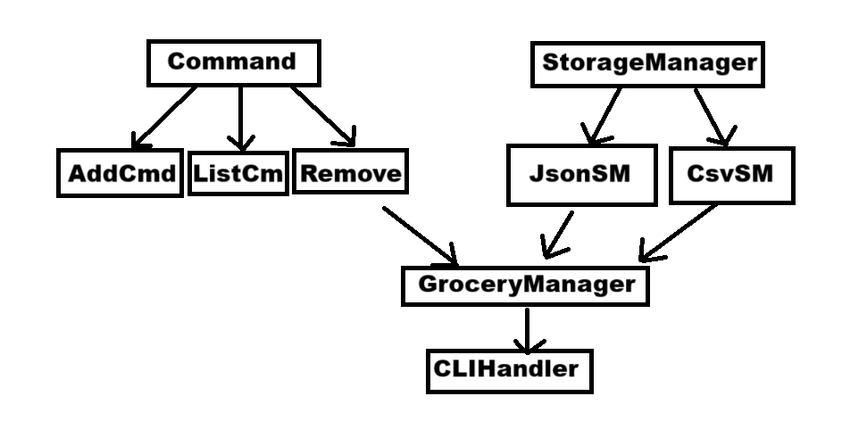

# Rapport TP1 - Système de Gestion de Liste de Courses

## Introduction

Ce rapport présente les modifications apportées au système de gestion de liste de courses, notamment l'ajout de la possibilité de stocker les informations dans un fichier CSV en plus du format JSON existant. On décrira les problèmes identifiés dans le code initial, les solutions implémentées, ainsi que les difficultés rencontrées et les succès obtenus.

## Modifications apportées

### 1. Problèmes identifiés dans le code initial

Lors de l'analyse du code initial, on a identifié plusieurs problèmes :

- **Duplication des données** : Le système ne consolidait pas correctement les articles avec le même nom, créant des entrées en double.
- **Format de stockage unique** : Les données ne pouvaient être stockées qu'au format JSON, limitant la flexibilité.
- **Structure de code rigide** : Le code ne suivait pas les principes SOLID, rendant difficile l'ajout de nouveaux formats de stockage.
- **Documentation insuffisante** : Le code manquait de commentaires et de documentation claire.
- **Sauvegarde redondante** : Dans la classe `CLIHandler`, une sauvegarde supplémentaire était effectuée après l'exécution de la commande, écrasant potentiellement les données déjà sauvegardées.

### 2. Solutions implémentées

#### Architecture modulaire pour les formats de stockage

On a créé une architecture modulaire pour gérer les différents formats de stockage :

- **Interface `StorageManager`** : Définit les opérations de base pour charger et sauvegarder les données.
- **Implémentation `JsonStorageManager`** : Gère le stockage au format JSON.
- **Implémentation `CsvStorageManager`** : Gère le stockage au format CSV selon les règles spécifiées.
- **Fabrique `StorageManagerFactory`** : Crée l'implémentation appropriée selon le format demandé.

#### Amélioration de la consolidation des données

On a amélioré le processus de consolidation des données pour éviter les doublons :

- Utilisation d'une `Map<String, Integer>` comme structure de données principale pour garantir l'unicité des articles.
- Implémentation d'un algorithme robuste de consolidation qui conserve la casse originale des noms d'articles.
- Optimisation de la méthode `loadGroceryList` pour consolider les données lors du chargement.

#### Nettoyage et refactorisation du code

On a effectué un nettoyage complet du code pour améliorer sa lisibilité et sa maintenabilité :

- Ajout d'une documentation JavaDoc complète pour toutes les classes et méthodes.
- Extraction de méthodes plus petites et spécialisées pour améliorer la lisibilité.
- Correction des erreurs potentielles et amélioration de la gestion des erreurs.
- Application de principes SOLID, notamment le principe de responsabilité unique.

#### Support du format CSV

On a implémenté le support du format CSV selon les règles spécifiées :

- Les colonnes sont séparées par des virgules.
- La première ligne contient les noms des colonnes (`item,quantity`).
- Les valeurs sont correctement échappées et formatées.

### 3. Difficultés rencontrées

Plusieurs difficultés ont été rencontrées lors de l'implémentation :

- **Cohérence des données** : S'assurer que les données restent cohérentes entre les différents formats était complexe, surtout pour la conservation de la casse des noms d'articles.
- **Tests existants** : L'adaptation des tests existants pour fonctionner avec la nouvelle architecture a nécessité une attention particulière.
- **Sauvegarde redondante** : Identifier le problème de sauvegarde redondante dans `CLIHandler` a pris du temps, car il n'était pas évident à première vue.
- **Environnement d'exécution** : Des problèmes avec l'environnement d'exécution ont rendu difficile le test des modifications en temps réel.

### 4. Succès obtenus

Malgré ces difficultés, plusieurs succès ont été obtenus :

- **Architecture flexible** : La nouvelle architecture permet d'ajouter facilement de nouveaux formats de stockage à l'avenir.
- **Consolidation robuste** : La consolidation des articles avec le même nom fonctionne désormais correctement.
- **Code propre et documenté** : Le code est maintenant bien documenté et organisé, facilitant sa maintenance future.
- **Support complet du CSV** : Le format CSV est entièrement pris en charge selon les spécifications.

## Schéma du projet

Voici un diagramme de classes simplifié du système :



## Format des commandes

Pour utiliser l'application avec les différents formats de stockage, les commandes suivantes sont disponibles :

```bash
# Format JSON (par défaut)
java -jar ./target/dp-2024-2025__grocery-list-1.0-SNAPSHOT.jar -s groceries.json add "Lait" 10

# Format CSV
java -jar ./target/dp-2024-2025__grocery-list-1.0-SNAPSHOT.jar -s groceries.csv --format csv add "Lait" 10

# Lister les articles
java -jar ./target/dp-2024-2025__grocery-list-1.0-SNAPSHOT.jar -s groceries.json list
```

## Conclusion

Les modifications apportées au système de gestion de liste de courses ont considérablement amélioré sa flexibilité, sa robustesse et sa maintenabilité. L'ajout du support du format CSV offre plus d'options aux utilisateurs, tandis que l'architecture modulaire facilite l'extension future du système.

Les problèmes initiaux de duplication des données et de rigidité du code ont été résolus, et le code est maintenant bien documenté et organisé. Bien que certaines difficultés aient été rencontrées, notamment dans la gestion de la cohérence des données et l'adaptation des tests, les solutions mises en œuvre ont permis de créer un système plus robuste et flexible.
